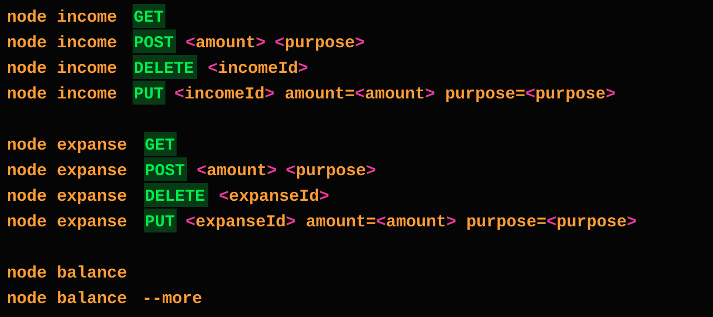

# Node CLI Budget Tracker

A small Node.js command-line homework project for tracking income, expenses, and the current balance. Records are stored locally in `data.json`.

## Homework

Build a command-line application using Node.js built-in and global features. The application should let a user manage income and expense records and calculate the remaining balance.

## What Is Implemented

- List, add, update, and delete income records.
- List, add, update, and delete expense records.
- Persist records as JSON using Node.js's built-in file system module.
- Calculate total income, total expenses, and net balance.
- Print a short balance or a detailed summary table.

## Command Reference



Run commands from the project directory, where `data.json` is located. The data file path is relative to the current working directory.

```sh
# Show all income or expense records
node income GET
node expanse GET

# Add a record (quote a purpose containing spaces)
node income POST 250 "monthly salary"
node expanse POST 40 "lunch"

# Update a record; replace the example IDs with IDs shown by GET
node income PUT 2 amount=300 purpose=bonus
node expanse PUT 1 amount=45 purpose="team lunch"

# Delete a record by ID
node income DELETE 2
node expanse DELETE 1

# Show the balance
node balance
node balance --more
```

The `income` and `expanse` commands support `GET`, `POST <amount> <purpose>`, `DELETE <id>`, and `PUT <id> amount=<amount> purpose=<purpose>`. `expanse` is the spelling used by this homework's source files and data structure.

## Setup

### Requirements

- Git
- Node.js installed and available as `node` in your terminal

There are no third-party dependencies, so `npm install` is not required.

### Clone and run

Replace the URL below with this repository's GitHub clone URL:

```sh
git clone https://github.com/<your-username>/<repository-name>.git
cd <repository-name>
node balance --more
```

Run the commands above in PowerShell, Command Prompt, or a Unix-like shell. The project uses `data.json` in the repository as its data store; commands that add, update, or delete records write changes to that file.

## Project Files

- `income.js` - income record commands.
- `expanse.js` - expense record commands.
- `balance.js` - balance calculation and summary output.
- `utils.js` - shared JSON read/write helpers.
- `data.json` - saved income and expense records.
- `package.json` - project metadata and ES module configuration.